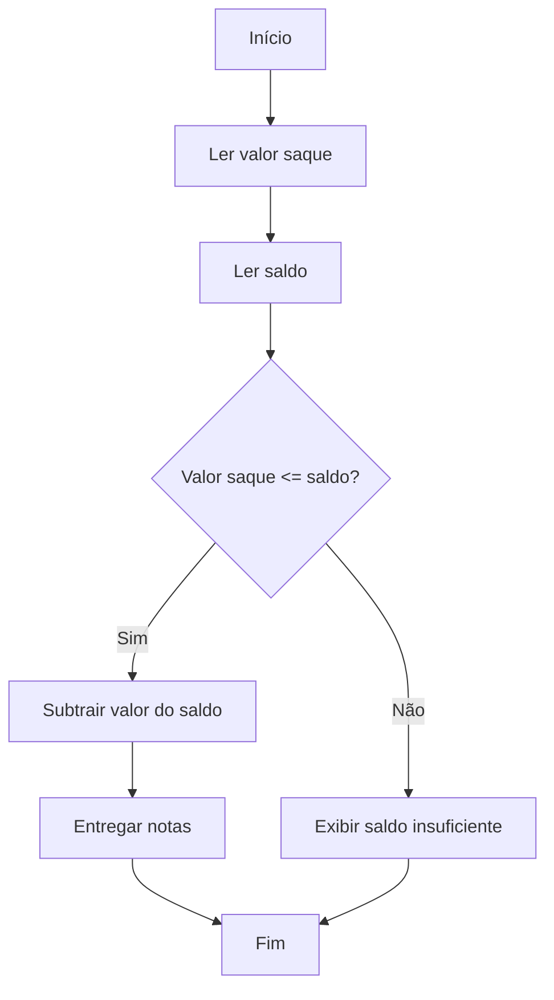

# Fluxograma Caixa Eletrônico

```mermaid
flowchart TD
A[Início] --> B[Ler valor saque]
B --> C[Ler saldo]
C --> D{Valor saque <= saldo?}

D -->|Sim| E[Subtrair valor do saldo]
E --> F[Entregar notas]

D -->|Não| G[Exibir saldo insuficiente]

F --> H[Fim]
G --> H
```
