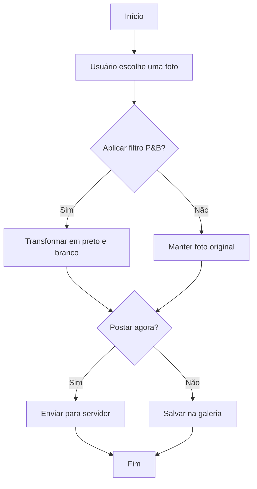

# Fluxograma Filtro Instagram

```mermaid
flowchart TD
A[Início] --> B[Usuário escolhe uma foto]
B --> C{Aplicar filtro P&B?}

C -->|Sim| D[Transformar em preto e branco]
C -->|Não| E[Manter foto original]

D --> F{Postar agora?}
E --> F

F -->|Sim| G[Enviar para servidor]
F -->|Não| H[Salvar na galeria]

G --> I[Fim]
H --> I
```
