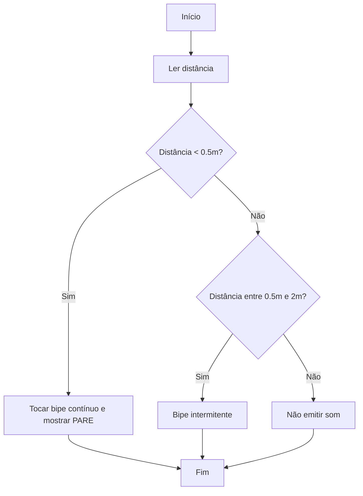

# Fluxograma Sensor de Ré

```mermaid
flowchart TD
A[Início] --> B[Ler distância]
B --> C{Distância < 0.5m?}

C -->|Sim| D[Tocar bipe contínuo e mostrar PARE]
C -->|Não| E{Distância entre 0.5m e 2m?}

E -->|Sim| F[Bipe intermitente]
E -->|Não| G[Não emitir som]

D --> H[Fim]
F --> H
G --> H
```
